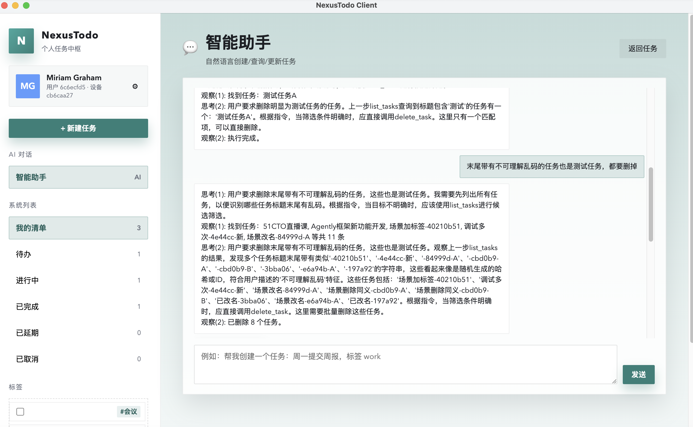

# NexusTodo (VibeCoding Edition)



An end-to-end, AI-assisted task system built through VibeCoding: a Go backend, a Python Agently-based agent service, and a streaming web client.

Chinese README: [README_cn.md](README_cn.md)

## Background / Context
This project was completed end-to-end via VibeCoding. The Golang backend was implemented by TRAE, while the remaining parts (agent service, client, and documentation) were built with VSCode + Codex. Parts of the setup were demonstrated live in a 51CTO course hosted by Maplemx. The overall build-and-optimization cycle took about six hours, with roughly four hours covered in the live session.

## What’s Inside
- **backend** (Go): task API, persistence, device registration.
- **auto_agent** (Python): ReAct loop, structured outputs, SSE streaming, task tool calls.
- **client** (Web): chat UI with streaming bubbles and task cards.

## Quick Start (2 Services + 1 Client)
1) **Backend** (default `8080`)
   ```bash
   cd backend
   go run main.go
   ```
2) **Auto Agent** (default `15590`)
   ```bash
   cd ..
   python -m uvicorn auto_agent.app:app --host 0.0.0.0 --port 15590
   ```
3) **Client**
   ```bash
   cd client
   npm install
   npm run dev
   ```

Full instructions: [PROJECT_OVERVIEW.md](PROJECT_OVERVIEW.md)

## Agently in This Project
The intelligent module is built on the Agently AI application framework.
- GitHub: [https://github.com/AgentEra/Agently](https://github.com/AgentEra/Agently)
- Official sites: [https://Agently.tech](https://Agently.tech) (EN), [https://Agently.cn](https://Agently.cn) (CN)

Agently provides the core primitives used here:
- Contract-first structured output (`output()` + `ensure_keys`).
- Tool planning without vendor lock-in.
- Streaming-friendly orchestration and ReAct-style loops.

## Documentation Map
- Project overview and startup: [PROJECT_OVERVIEW.md](PROJECT_OVERVIEW.md)
- Backend API and design: [backend/docs/api-documentation.md](backend/docs/api-documentation.md), [backend/docs/backend-design.md](backend/docs/backend-design.md)
- Agent design and APIs: [auto_agent/docs/dev_design.md](auto_agent/docs/dev_design.md), [auto_agent/docs/api-documentation.md](auto_agent/docs/api-documentation.md)
- Chat/LLM ops spec: [auto_agent/docs/spec-dd-llm-chat-ops.md](auto_agent/docs/spec-dd-llm-chat-ops.md)
- Client usage: [client/docs/client-documentation.md](client/docs/client-documentation.md)
- Test reports: [auto_agent/docs/test-report.md](auto_agent/docs/test-report.md), [backend/docs/test-report.md](backend/docs/test-report.md)
- Launch / promo article: [docs/wechat-article.md](docs/wechat-article.md), [docs/wechat-article_cn.md](docs/wechat-article_cn.md)

## VibeCoding Process & Quality Loop
A detailed write-up of guidance, self-checks, scenario design, and iterative optimization:
- English: [docs/vibecoding-process.md](docs/vibecoding-process.md)
- Chinese: [docs/vibecoding-process_cn.md](docs/vibecoding-process_cn.md)

## Agently + VibeCoding Learnings
We summarize the effectiveness of Agently-driven VibeCoding and the self-bootstrapping loop for production-grade agent systems:
- Deterministic, schema-first outputs to reduce ambiguity.
- Real-API integration scenarios as the primary validation gate.
- Prompt + parser updates as regression fixes, captured in docs.

## Community & Contribution (Agently)
- Documentation: [https://Agently.tech/docs](https://Agently.tech/docs)
- GitHub: [https://github.com/AgentEra/Agently](https://github.com/AgentEra/Agently)
- Examples (Agently repo):
  - [https://github.com/AgentEra/Agently/tree/main/examples/step_by_step/](https://github.com/AgentEra/Agently/tree/main/examples/step_by_step/)
  - [https://github.com/AgentEra/Agently/tree/main/examples/step_by_step/13-auto_loop_fastapi/](https://github.com/AgentEra/Agently/tree/main/examples/step_by_step/13-auto_loop_fastapi/)
- Discussions: [https://github.com/AgentEra/Agently/discussions](https://github.com/AgentEra/Agently/discussions)
- Issues & contributions: [https://github.com/AgentEra/Agently/issues](https://github.com/AgentEra/Agently/issues)

### Join the Agently WeChat Group
You can find the official WeChat group entry in either place below:
- Agently official site ([https://Agently.tech](https://Agently.tech)): navigate to the WeChat Group / Join Us entry.
- Agently GitHub homepage ([https://github.com/AgentEra/Agently](https://github.com/AgentEra/Agently)): open the "WeChat Group (Join Us)" section.

Current application form from the GitHub README:
- [https://doc.weixin.qq.com/forms/AIoA8gcHAFMAScAhgZQABIlW6tV3l7QQf](https://doc.weixin.qq.com/forms/AIoA8gcHAFMAScAhgZQABIlW6tV3l7QQf)
