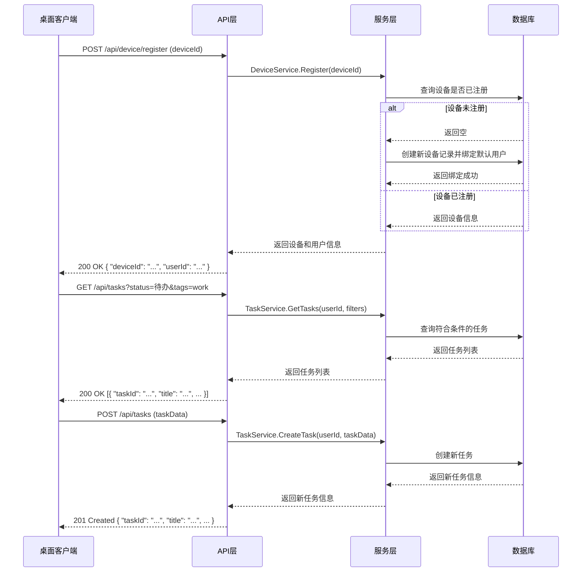

# NexusTodo 后端功能设计文档

## 1. 概述

本设计文档基于 NexusTodo 个人TODO管理桌面应用的需求，详细描述后端系统的功能设计、技术选型、架构设计、API设计、数据模型等内容。后端系统采用 Golang 实现，提供 RESTful API 接口，支持设备注册、任务管理、数据同步等核心功能。

## 2. 技术选型

| 分类 | 技术 | 版本 | 选型理由 |
| :--- | :--- | :--- | :--- |
| 语言 | Golang | 1.20+ | 编译型语言，性能优异，生态成熟，适合后端服务。 |
| 框架 | Gin | v1.9.0+ | 轻量级高性能框架，路由性能出色，中间件机制灵活，适合构建RESTful API。 |
| 数据库 | SQLite | 3.40+ | 轻量级嵌入式数据库，无需独立部署，适合桌面应用的后端服务，支持JSON类型。 |
| 缓存 | SQLite | 3.40+ | 利用SQLite作为缓存存储，简化部署和维护。 |
| 认证 | 默认Token | - | 使用简单的默认Token进行认证，简化实现。 |

## 3. 架构设计

### 3.1 核心架构

- **架构风格**: 集成式单体应用 (Integrated Monolith)。后端逻辑作为独立模块，与前端通过API交互。
- **模块划分**:
  - `api`: 路由和请求处理
  - `services`: 业务逻辑
  - `models`: 数据模型
  - `schemas`: 请求/响应结构
  - `middleware`: 中间件
  - `config`: 配置管理
  - `utils`: 工具函数

### 3.2 核心流程图



## 4. 数据模型设计

### 4.1 核心实体

#### 4.1.1 User (用户)

| 字段名 | 数据类型 | 约束 | 描述 |
| :--- | :--- | :--- | :--- |
| `id` | `UUID` | `PRIMARY KEY` | 用户ID |
| `created_at` | `TIMESTAMP` | `NOT NULL DEFAULT NOW()` | 创建时间 |
| `updated_at` | `TIMESTAMP` | `NOT NULL DEFAULT NOW()` | 更新时间 |

#### 4.1.2 Device (设备)

| 字段名 | 数据类型 | 约束 | 描述 |
| :--- | :--- | :--- | :--- |
| `id` | `UUID` | `PRIMARY KEY` | 设备ID (客户端生成的UUID) |
| `user_id` | `UUID` | `REFERENCES users(id)` | 关联的用户ID |
| `last_seen_at` | `TIMESTAMP` | `NOT NULL DEFAULT NOW()` | 最后活跃时间 |
| `created_at` | `TIMESTAMP` | `NOT NULL DEFAULT NOW()` | 创建时间 |
| `updated_at` | `TIMESTAMP` | `NOT NULL DEFAULT NOW()` | 更新时间 |

#### 4.1.3 Task (任务)

| 字段名 | 数据类型 | 约束 | 描述 |
| :--- | :--- | :--- | :--- |
| `id` | `UUID` | `PRIMARY KEY` | 任务ID |
| `user_id` | `UUID` | `REFERENCES users(id)` | 关联的用户ID |
| `title` | `VARCHAR(255)` | `NOT NULL` | 任务标题 |
| `description` | `TEXT` | | 任务描述 |
| `status` | `VARCHAR(20)` | `NOT NULL DEFAULT '待办'` | 任务状态 (待办/进行中/已完成/已延期/已取消) |
| `tags` | `TEXT[]` | | 自定义标签数组 |
| `created_at` | `TIMESTAMP` | `NOT NULL DEFAULT NOW()` | 创建时间 |
| `updated_at` | `TIMESTAMP` | `NOT NULL DEFAULT NOW()` | 更新时间 |

### 4.2 数据传输对象 (DTOs)

#### 4.2.1 设备注册请求

```go
type DeviceRegisterRequest struct {
    DeviceID string `json:"deviceId" binding:"required,uuid"`
}
```

#### 4.2.2 设备注册响应

```go
type DeviceRegisterResponse struct {
    DeviceID string `json:"deviceId"`
    UserID   string `json:"userId"`
    Message  string `json:"message"`
}
```

#### 4.2.3 任务创建请求

```go
type TaskCreateRequest struct {
    Title       string   `json:"title" binding:"required"`
    Description string   `json:"description"`
    Tags        []string `json:"tags"`
}
```

#### 4.2.4 任务更新请求

```go
type TaskUpdateRequest struct {
    Title       string   `json:"title"`
    Description string   `json:"description"`
    Status      string   `json:"status" binding:"omitempty,oneof=待办 进行中 已完成 已延期 已取消"`
    Tags        []string `json:"tags"`
}
```

#### 4.2.5 任务响应

```go
type TaskResponse struct {
    TaskID      string    `json:"taskId"`
    UserID      string    `json:"userId"`
    Title       string    `json:"title"`
    Description string    `json:"description"`
    Status      string    `json:"status"`
    Tags        []string  `json:"tags"`
    CreatedAt   time.Time `json:"createdAt"`
    UpdatedAt   time.Time `json:"updatedAt"`
}
```

## 5. API 设计

### 5.1 设备管理

| API路径 | 方法 | 模块/文件 | 类型 | 功能描述 | 请求体 (JSON) | 成功响应 (200 OK) |
| :--- | :--- | :--- | :--- | :--- | :--- | :--- |
| `/api/device/register` | `POST` | `api/device.go` | `Router` | 设备注册 | `{"deviceId": "uuid"}` | `{"deviceId": "uuid", "userId": "uuid", "message": "注册成功"}` |
| `/api/device/status` | `GET` | `api/device.go` | `Router` | 设备状态检查 | N/A | `{"deviceId": "uuid", "userId": "uuid", "lastSeenAt": "timestamp"}` |

### 5.2 任务管理

| API路径 | 方法 | 模块/文件 | 类型 | 功能描述 | 请求体 (JSON) | 成功响应 |
| :--- | :--- | :--- | :--- | :--- | :--- | :--- |
| `/api/tasks` | `GET` | `api/task.go` | `Router` | 获取任务列表 (支持过滤) | N/A (查询参数: status, tags) | `[{"taskId": "uuid", "title": "...", ...}]` |
| `/api/tasks` | `POST` | `api/task.go` | `Router` | 创建新任务 | `{"title": "...", "description": "...", "tags": [...]}` | `{"taskId": "uuid", "title": "...", ...}` (201 Created) |
| `/api/tasks/:taskId` | `GET` | `api/task.go` | `Router` | 获取任务详情 | N/A | `{"taskId": "uuid", "title": "...", ...}` |
| `/api/tasks/:taskId` | `PUT` | `api/task.go` | `Router` | 更新任务 | `{"title": "...", "status": "...", "tags": [...]}` | `{"taskId": "uuid", "title": "...", ...}` |
| `/api/tasks/:taskId` | `DELETE` | `api/task.go` | `Router` | 删除任务 | N/A | `{"message": "删除成功"}` |

## 6. 业务逻辑设计

### 6.1 设备注册流程

1. 客户端发送设备ID (UUID) 到 `/api/device/register`
2. 后端检查设备是否已注册
3. 若未注册:
   - 为设备创建新记录
   - 为设备绑定默认用户 (若用户不存在则创建)
   - 更新设备最后活跃时间
   - 返回设备ID和用户ID
4. 若已注册:
   - 更新设备最后活跃时间
   - 返回设备ID和用户ID

### 6.2 任务管理流程

#### 6.2.1 创建任务

1. 客户端发送任务数据到 `/api/tasks`
2. 后端验证请求数据
3. 从请求头获取用户ID
4. 创建新任务记录
5. 返回新任务信息

#### 6.2.2 更新任务

1. 客户端发送更新数据到 `/api/tasks/:taskId`
2. 后端验证请求数据
3. 从请求头获取用户ID
4. 检查任务是否存在且属于该用户
5. 更新任务信息
6. 返回更新后的任务信息

#### 6.2.3 删除任务

1. 客户端发送删除请求到 `/api/tasks/:taskId`
2. 从请求头获取用户ID
3. 检查任务是否存在且属于该用户
4. 删除任务记录
5. 返回删除成功消息

#### 6.2.4 获取任务列表

1. 客户端发送获取请求到 `/api/tasks` (可带查询参数)
2. 从请求头获取用户ID
3. 根据查询参数过滤任务
4. 返回符合条件的任务列表

## 7. 安全设计

### 7.1 认证与授权

- **设备认证**: 使用设备ID和默认Token作为认证标识，通过请求头传递
- **授权检查**: 确保用户只能访问自己的任务数据
- **中间件验证**: 实现认证中间件，验证默认Token和设备ID的有效性

### 7.2 数据安全

- **数据传输**: 所有API通信必须使用HTTPS
- **数据存储**: 敏感数据加密存储
- **输入验证**: 严格验证所有输入数据，防止注入攻击

### 7.3 防滥用措施

- **速率限制**: 对API请求实施速率限制，防止恶意请求
- **日志记录**: 记录所有API请求和关键操作，便于审计和问题排查

## 8. 部署与集成方案

### 8.1 依赖与环境

| 依赖 | 版本/范围 | 用途 | 安装命令 |
| :--- | :--- | :--- | :--- |
| `github.com/gin-gonic/gin` | `v1.9.0+` | Web框架 | `go get -u github.com/gin-gonic/gin` |
| `gorm.io/gorm` | `v1.25.0+` | ORM | `go get -u gorm.io/gorm` |
| `gorm.io/driver/sqlite` | `v1.5.0+` | SQLite驱动 | `go get -u gorm.io/driver/sqlite` |
| `github.com/google/uuid` | `v1.3.0+` | UUID生成 | `go get -u github.com/google/uuid` |
| `github.com/gin-contrib/cors` | `v1.4.0+` | CORS中间件 | `go get -u github.com/gin-contrib/cors` |

### 8.2 集成与启动方案

- **配置文件**: `config/config.go`，支持环境变量配置
- **启动脚本**: `main.go`，初始化数据库连接，启动HTTP服务
- **环境变量**:
  - `DATABASE_PATH`: SQLite数据库文件路径
  - `PORT`: 服务端口
  - `DEFAULT_TOKEN`: 默认认证令牌

### 8.3 目录结构

```plaintext
backend/
  ├── api/
  │   ├── device.go     # 设备相关API
  │   ├── task.go       # 任务相关API
  │   └── router.go     # 路由配置
  ├── services/
  │   ├── device.go     # 设备业务逻辑
  │   └── task.go       # 任务业务逻辑
  ├── models/
  │   ├── device.go     # 设备数据模型
  │   ├── task.go       # 任务数据模型
  │   └── user.go       # 用户数据模型
  ├── schemas/
  │   ├── device.go     # 设备相关DTO
  │   └── task.go       # 任务相关DTO
  ├── middleware/
  │   ├── auth.go       # 认证中间件
  │   └── cors.go       # CORS中间件
  ├── config/
  │   └── config.go     # 配置管理
  ├── utils/
  │   └── utils.go      # 工具函数
  ├── docs/
  │   └── backend-design.md  # 后端设计文档
  ├── main.go           # 应用入口
  ├── go.mod
  └── go.sum
```

## 9. 监控与维护

### 9.1 日志设计

- **日志级别**: DEBUG, INFO, WARN, ERROR
- **日志格式**: JSON格式，便于日志系统解析
- **关键操作日志**: 记录设备注册、任务创建/更新/删除等关键操作

### 9.2 错误处理

- **统一错误响应**: 实现统一的错误响应格式
- **错误码**: 定义标准错误码，便于前端处理
- **错误日志**: 详细记录错误信息，便于问题排查

### 9.3 数据清理

- **设备清理**: 提供管理接口，清理长期未活跃的设备及关联数据
- **数据备份**: 定期备份数据库，防止数据丢失

## 10. 扩展性考虑

### 10.1 多设备支持

- **设备关联**: 支持一个用户关联多个设备
- **数据同步**: 确保多设备数据一致性

### 10.2 未来功能扩展

- **用户认证**: 支持用户账号登录
- **任务提醒**: 实现任务提醒功能
- **数据分析**: 提供任务完成情况分析
- **API版本控制**: 设计API版本控制机制，便于未来升级

## 11. 总结

本设计文档详细描述了 NexusTodo 后端系统的功能设计，包括技术选型、架构设计、API设计、数据模型等内容。后端系统采用 Golang + Gin + SQLite 技术栈，提供设备注册、任务管理等核心功能，支持数据同步和安全认证。系统设计考虑了可扩展性和安全性，为未来功能扩展预留了空间。

通过本设计方案，后端系统将能够满足 NexusTodo 桌面应用的所有功能需求，为用户提供稳定、安全、高效的服务。